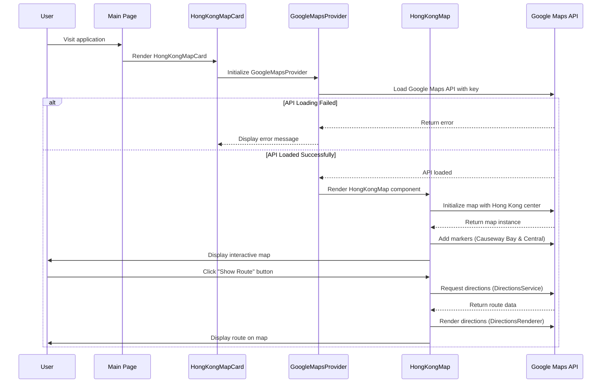
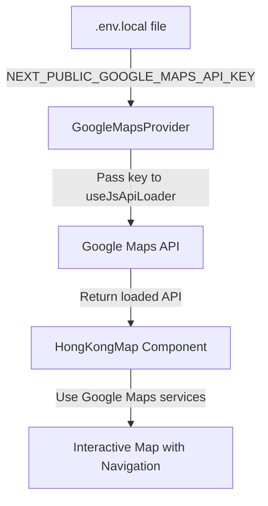
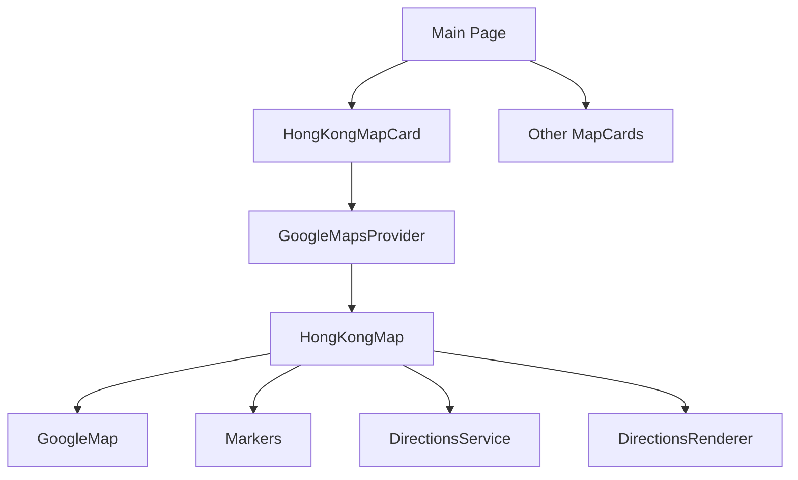
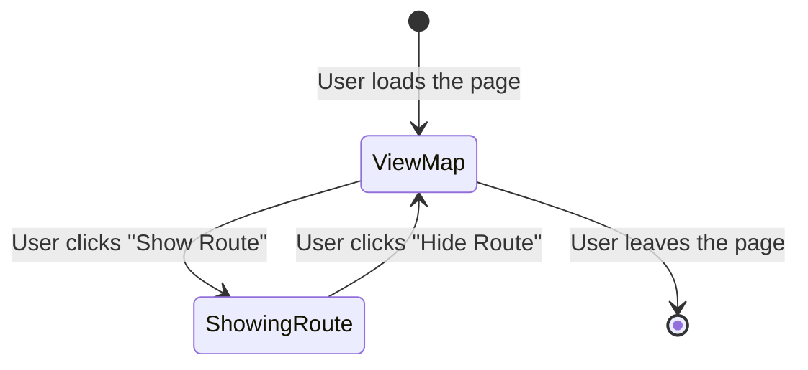

# Google Maps API Integration Flow

This document outlines the sequence of interactions between components in our Google Maps integration.

## Component Interaction Sequence Diagram

## API Key Flow

## Component Hierarchy

## User Interaction Flow

