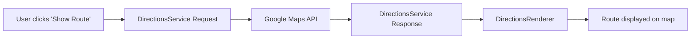

# Google Maps API Navigation Guide

This document provides a simplified explanation of the Google Maps API request/response flow for navigation between Causeway Bay and Central in Hong Kong.

## API Request Flow



## Request Payload

When requesting directions between two points, we send this simple payload:

```javascript
{
  origin: {
    lat: 22.2808,
    lng: 114.1837     // Causeway Bay coordinates
  },
  destination: {
    lat: 22.2816,
    lng: 114.1589     // Central coordinates
  },
  travelMode: google.maps.TravelMode.TRANSIT  // Using public transit
}
```

The key components are:
- **origin**: Starting point coordinates
- **destination**: Ending point coordinates
- **travelMode**: Method of transportation (TRANSIT, DRIVING, WALKING, BICYCLING)

## Response Structure

The API returns a comprehensive response with route information:

```javascript
{
  routes: [
    {
      legs: [
        {
          steps: [
            {
              // Walking segment
              travel_mode: "WALKING",
              instructions: "Walk to Causeway Bay MTR Station",
              distance: { text: "300 m", value: 300 },
              duration: { text: "4 mins", value: 240 }
            },
            {
              // Transit segment
              travel_mode: "TRANSIT",
              instructions: "MTR Island Line towards Central",
              distance: { text: "3.2 km", value: 3200 },
              duration: { text: "8 mins", value: 480 },
              transit: {
                line: { name: "Island Line" },
                departure_stop: { name: "Causeway Bay Station" },
                arrival_stop: { name: "Central Station" }
              }
            },
            // Additional steps...
          ],
          distance: { text: "3.8 km", value: 3800 },
          duration: { text: "18 mins", value: 1080 }
        }
      ],
      overview_polyline: {
        points: "encoded_polyline_data"  // Used to draw the route
      }
    }
  ],
  status: "OK"
}
```

Key elements of the response:
- **routes**: Array of possible routes (usually we use the first one)
- **legs**: Journey segments
- **steps**: Step-by-step instructions
- **overview_polyline**: Encoded path data for drawing the route
- **status**: Success/error indicator

## Rendering the Route

We pass the response to the DirectionsRenderer component:

```javascript
<DirectionsRenderer
  options={{
    directions: directionsResult,  // The full response
    polylineOptions: {
      strokeColor: '#00b4ff',      // Blue line color
      strokeWeight: 4              // Line thickness
    },
    markerOptions: {
      visible: false               // Hide default markers
    }
  }}
/>
```

## Code Implementation

Here's how we implement this in our React component:

```javascript
// 1. Set up state for directions
const [directions, setDirections] = useState(null);
const [showDirections, setShowDirections] = useState(false);

// 2. Create callback for directions result
const directionsCallback = useCallback((result, status) => {
  if (status === 'OK' && result) {
    setDirections(result);
  }
}, []);

// 3. Render components
return (
  <div>
    <GoogleMap>
      {/* Markers for locations */}
      <Marker position={causewayBay} label="A" />
      <Marker position={central} label="B" />
      
      {/* Request directions when showDirections is true */}
      {showDirections && (
        <DirectionsService
          options={{
            origin: causewayBay,
            destination: central,
            travelMode: google.maps.TravelMode.TRANSIT
          }}
          callback={directionsCallback}
        />
      )}
      
      {/* Render directions when we have a result */}
      {directions && showDirections && (
        <DirectionsRenderer
          options={{
            directions: directions,
            polylineOptions: { strokeColor: '#00b4ff', strokeWeight: 4 },
            markerOptions: { visible: false }
          }}
        />
      )}
    </GoogleMap>
    
    {/* Toggle button */}
    <button onClick={() => setShowDirections(!showDirections)}>
      {showDirections ? 'Hide Route' : 'Show Route'}
    </button>
  </div>
);
```

## Common Error Statuses

| Status | Description |
|--------|-------------|
| `OK` | Request was successful |
| `ZERO_RESULTS` | No route could be found |
| `OVER_QUERY_LIMIT` | Too many requests |
| `REQUEST_DENIED` | Service usage denied |
| `INVALID_REQUEST` | Invalid request parameters | 